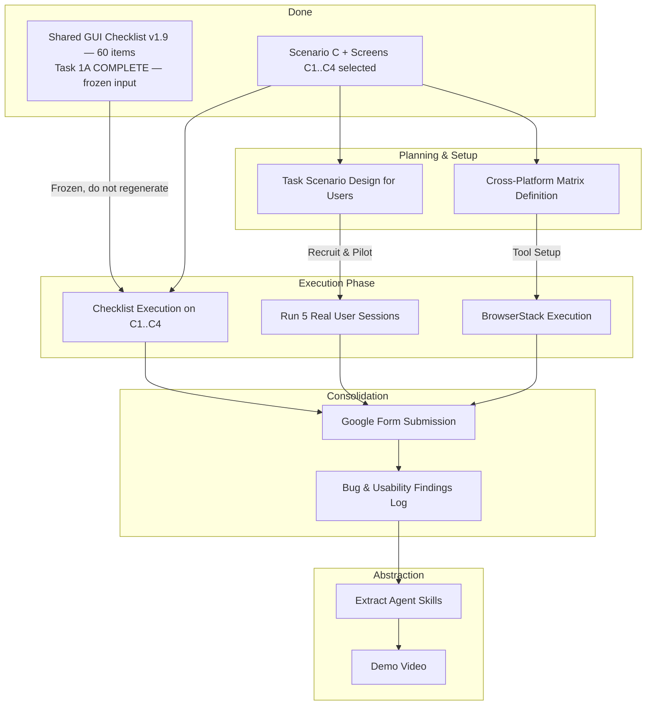

# Architecture & Approach Document
## HW3 — GUI & Usability Testing on EMS

**Student:** Nguyen Bao Duy (MSSV: 23127179) — Group 09
**Scenario:** **C — Admin manages users** · Screens **C1–C4**
**Context:** Group Assignment with Individual Core Deliverables
**Last updated:** 2026-08-02

---

## 1. System Overview
- **System Under Test (SUT):** Event Management System (EMS) — a LIVE, **external** web application.
- **SUT URL (§4):** https://prod-dev.ems-fitus.cloud/login?callbackUrl=%2F
- **Admin account (§4):** `admin@gmail.com` / `Admin@123` — sufficient for the whole of scenario C.
- **Black-box only.** EMS source code is not available and is not examined. Every verdict in this project comes from the rendered UI, the accessibility tree, DevTools, and the browser — never from reading application code. The `eshop` code in this repository is unrelated leftover structure from a previous assignment and is **not** the SUT.
- **Volatility (§4):** the instance is tunnelled and its data may be reset periodically. Capture evidence as you go; never assume state you created earlier survives to the next session.
- **Assignment Structure:** Group assignment (3-4 students) with a shared component (GUI Checklist Design) and individual core execution (Checklist execution, Usability, Cross-Browser, Bug Logging, Skills).

## 2. Decomposition into Pipelines / Capabilities
The assignment is structured into 6 distinct testing pipelines and a set of cross-cutting concerns:

### Pipeline 1: Shared GUI Checklist Design (Group, Task 1A, 15pts) — ✅ **COMPLETE**
- **Status:** delivered as `hw3/docs/gui-checklist/Shared_GUI_Checklist.md` **v1.9 — 60 items** across IA-01…IA-04 (§6 requires > 40). Five review rounds are documented in its changelog.
- **Consequence for this project: no checklist is to be generated.** This pipeline is a **frozen input** to Pipeline 2, not work to be done. Item wording must stay identical across the group (§18) — a defect found in an item is raised with the group, never patched in a personal copy.
- **Outstanding (group-side, optional):** v1.7–v1.9 group sign-off, and the pillar-4 "team experience" gap (4/60) retargeted to v2.0. Neither blocks Pipeline 2.
- **Companion group artefacts required by §15 but absent from this repo:** reference-sources list, checklist AI prompts, live-survey record, the 14 source screenshots. Obtain from the group — see blocker **B-11**.

### Pipeline 2: Checklist Execution (Individual, Task 1B, 15pts) — **entry point of my work**
- **Workflow:** Execute the **existing frozen** 60-item checklist against my **four** screens (C1 Users list · C2 Assign Role/Edit user · C3 Block-Unblock & Reset-Password dialogs · C4 Export to Excel).
- **Execution verdicts — Pass / Fail / N/A.** §6 Part B names only Passed and Failed, but the checklist is shared across scenarios A–D and some items describe widgets that do not exist on a user-admin screen. Marking those Pass would be false; marking them Fail would invent a defect. **Every N/A carries a mandatory one-line reason, and N/A is never counted as a pass.**
- **Evidence:** screenshots **only** for Failed items.
- **Deliverables:** per-screen Pass/Fail/N/A matrix + Notes column, structured Bug Reports (Steps, Expected, Actual, Severity, Screenshot).

### Pipeline 3: User Testing (Individual, Task 2, 25pts)
- **Phase 1 (Preparation):** Design task scenarios, define metrics (SUS/UEQ-S), recruit **5 REAL participants**, and run a pilot session.
- **Phase 2 (Execution):** Run 5 sessions using Think-Aloud protocol, neutral observation, and post-task probing.
- **Phase 3 (Analysis):** Score metrics, analyze qualitative feedback, and produce the final Usability Report.
- **CRITICAL:** Participants must be real humans. The TA may call 2 to verify. No AI simulation of user data is permitted.

### Pipeline 4: Cross-Browser/Cross-Platform (Individual, Task 3, 25pts)
- **Workflow:** Define compatibility matrix (3 OS × 5 Browsers × 3 Device classes per screen).
- **Constraint:** Not all 45 combinations are required, but every OS, Browser, and Device class must be tested at least once per screen.
- **Execution:** Use BrowserStack or LambdaTest trial to capture actual rendering.
- **Deliverables:** Screenshots with MSSV/email overlay to prove authenticity.

### Pipeline 5: Findings Consolidation (Individual, Task 4, 10pts)
- **Workflow:** Every bug and usability finding from Pipelines 2, 3, and 4 is submitted to a centralized Google Form.
- **Deliverables:** Aggregated Bug & Usability Findings Log. Data must perfectly match the Google Form entries.

### Pipeline 6: Agent Skills (Individual, Task 5, 10pts)
- **Workflow:** Extract reusable automation skills from proven, manually piloted methodologies.
- **Deliverables:** Packaged AI Agent Skills and a YouTube demo video.

### Cross-Cutting Concerns
- **AI Audit Log:** Continuous tracking of AI interactions (Tool, Timestamp, Prompt, Output).
- **AI Critique:** Analyzing where AI succeeds vs. where human intervention was required.
- **Git Commit Discipline:** Traceable, atomic commits reflecting the freeze-before-execute philosophy.

## 3. Pipeline Dependencies & Data Flow

## 4. Roles: AI vs Human vs Browser Tools vs Real Users

| Pipeline | AI Role | Human Role | Tools Required | Real Users Required |
| :--- | :--- | :--- | :--- | :--- |
| **1. Checklist** *(done)* | Generated the initial items; ran the four audit rounds | Reviewed, corrected, added the items AI missed, documented the blind spots | Markdown | No |
| **2. Execution** | Format bug reports, analyze captured DOM/images | Manually navigate EMS, capture real screenshots, make the Pass/Fail/N/A judgment | Browser, DevTools | No |
| **3. Usability** | Help design task scripts, calculate SUS/UEQ-S scores, synthesize notes | Recruit, moderate sessions, observe neutrally | Screen recording | **YES (5 minimum)** |
| **4. Cross-Platform** | Generate coverage matrix to satisfy constraints | Run the matrix, overlay MSSV on evidence | BrowserStack / LambdaTest | No |
| **5. Consolidation** | Parse bug reports into structured CSV/Log format | Submit to Google Form, verify consistency | Google Forms | No |

## 5. Invariants / Rules Enforced Throughout
1. **REAL EVIDENCE ONLY:** Screenshots, user data, and cross-platform captures MUST be real. No fabrication (§12).
2. **BLACK-BOX ONLY:** EMS is an external SUT. No source-code access, no code analysis, no implementation or fixes. Findings are observed through the UI, the accessibility tree and DevTools.
3. **THE CHECKLIST IS INPUT, NOT OUTPUT:** Task 1A is delivered. Never regenerate, rewrite or re-scope checklist items; §18 requires them identical across the group.
4. **AI-FIRST BUT DISCIPLINED:** Guide AI step-by-step; do not use zero-shot generic prompts for complex tasks (§2).
5. **HUMAN REVIEW AT GATES:** Every AI output must be reviewed before becoming a committed deliverable (§2).
6. **FREEZE BEFORE EXECUTE:** Test artifacts must be finalized and committed before execution begins — and the commit order must prove it.
7. **AUDIT AS YOU GO:** AI interactions logged at creation time, never reconstructed retroactively (§10).
8. **SINGLE SOURCE OF TRUTH:** No duplicate data stores for testing artifacts.
9. **FINDINGS CONSISTENCY:** Google Form entries must match the aggregated Findings Log; the TA may cross-check counts (§7).
10. **N/A IS NOT A PASS:** Any non-applicable checklist item carries a written reason and is excluded from the pass count.

## 6. Workflow Practices Reused from Earlier Coursework

`hw2-summary.md` is a **workflow reference only — never a requirement source.** Where it conflicts with the HW3 requirement, the requirement wins and the HW2 habit is dropped. What is reused is process discipline, not content:

| Practice reused | Why it still applies here |
| :--- | :--- |
| Human-in-the-loop at decision gates | §2 mandates human review of every AI result |
| Freeze-before-execute | The shared checklist must be frozen before Task 1B; commit order is the proof |
| Example-first: manual pilot precedes skill extraction | §8 asks for skills that demonstrably worked on a real flow |
| Capability-based, decoupled skills | §8 asks for skills reusable on *additional* EMS screens and flows |
| Audit-as-you-go logging | §10 requires a complete log of AI use |
| Evidence-based reporting | §12 verifies evidence during grading |
| Atomic, semantic git commits | §13 requires one commit per testing step |

**Explicitly dropped from the HW2 workflow:** the specification-derived test oracle (here the oracle is heuristic — Nielsen / Norman / Shneiderman / WCAG / the course slides), the source-code-grounded Testing Model, structural guards on expected values, and anything premised on the SUT being a local API this project controls. There is no implementation, debugging or code-change work of any kind in HW3.

## 7. Blockers and Assumptions

Live blocker tracking is in **`blockers.md`** — that file, not this one, is the source of truth for status. Summary as of 2026-08-02:

- **Resolved:** scenario (C), screens (C1–C4), group membership (09), the shared checklist (v1.9, 60 items), the account needed (`admin@gmail.com`).
- **Open:** EMS reachability · BrowserStack/LambdaTest trial · 1 pilot participant · 5 real participants · student-ID email for overlays and the Google Form · the group companion artefacts missing from this repo (**B-11**) · whether C2 and C3 are one dialog or two screens (**B-12**).

### Assumptions
- **ASSUMPTION-01:** The student executes all individual core deliverables independently; only Task 1A was a group product.
- **ASSUMPTION-02:** The AI Audit format follows §10 — AI tool, date and time, verbatim prompt, output — per interaction, plus the human verdict and correction.
- **ASSUMPTION-03:** The scenario/screen assignment recorded in the shared checklist is the group's committed allocation. If the group later reassigns, `screen-selection.md` and `blockers.md` are updated first, before any execution.
