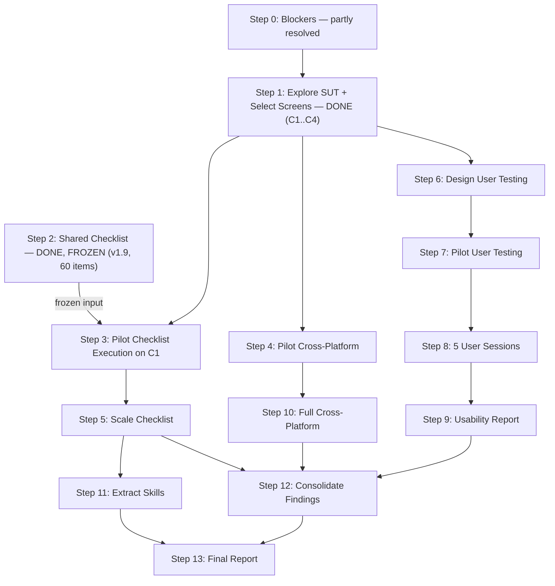

# HW3 Execution Workflow

This document outlines the end-to-end workflow for executing HW3 (GUI & Usability Testing on EMS). It defines the boundaries, sequencing, artifact generation, and specific disciplines required to meet the assignment requirements.

**EMS is an external, live web SUT tested manually through its UI. No source code is read, analysed, implemented or modified anywhere in this workflow.**

## 1. Group vs Individual Work Boundary

- **Group work — DONE.** Shared GUI Checklist design (Task 1A): `hw3/docs/gui-checklist/Shared_GUI_Checklist.md`, **v1.9, 60 items** across IA-01…IA-04. The handoff has already happened; this is now a **frozen input**.
- **Individual work:** everything else — per-screen checklist **execution** (Task 1B), User Testing with 5 real users (Task 2), Cross-Platform Testing (Task 3), findings consolidation (criterion 4), and Agent Skills (criterion 5).
- **Where my Task 1 begins:** at **Part B** — running the existing checklist against my screens. Not at item design.
- **Coordination — settled.** Group 09 assigned four distinct scenarios (A/B/C/D); mine is **C**, screens **C1–C4**. §5's no-duplication rule is satisfied by scenario alone.
- **§18 constraint:** the shared checklist is the *only* artefact allowed to be identical across the group. Screen selection, execution results, findings and severities must each be my own. Never edit item wording in a personal copy.

## 2. Timeline / Sequencing

## 3. When each key artifact is created

- **Shared checklist:** ✅ already created and frozen (Step 2 complete). Nothing further to produce.
- **Per-screen execution results:** Created in Steps 3 (Pilot on C1) and 5 (Scale to C2, C3, C4).
- **Bug reports:** Drafted in Steps 3 and 5 as bugs are discovered.
- **User testing scenario:** Defined in Step 6.
- **Pilot session notes:** Documented in Step 7.
- **User session records:** Recorded progressively in Step 8.
- **Usability Report:** Compiled in Step 9.
- **Compatibility matrix:** Drafted in Step 4, completed in Step 10.
- **Findings Log:** Progressively built across Steps 3, 5, 9, 10, and finalized in Step 12.
- **AI Audit:** Continuously updated throughout all steps.
- **Git commits:** Performed continuously (one per step/sub-step).

## 3a. Verdict convention (Task 1B)

Per the shared checklist's own rule: **Pass / Fail / N/A**.

- **Pass** — the item applies to this screen and the expected behaviour was observed.
- **Fail** — the item applies and the expected behaviour was **not** observed. Screenshot attached, reason written in Notes.
- **N/A** — the widget the item describes is absent from this screen. **A one-line reason is mandatory.**

**N/A is never counted as a pass.** The README summary reports *items designed (60) / applicable / executed / passed / failed* per screen. Screenshots are attached for **Failed items only** (§6 Part B).

## 3b. Evidence naming

One convention across all three tasks, so a screenshot can be traced back to its source without opening it.

| Evidence type | Pattern | Example |
| :--- | :--- | :--- |
| Checklist failure (Task 1B) | `<SCREEN>_<ITEM-ID>_<slug>.png` | `C1_IA03-06_pagination-count-mismatch.png` |
| Usability session (Task 2) | `P<n>_<SCREEN>_<slug>.png` · recordings `P<n>_session.<ext>` | `P3_C2_role-dropdown-hesitation.png` |
| Cross-platform cell (Task 3) | `<SCREEN>_<OS>_<Browser>_<DeviceClass>.png` | `C1_Windows_Firefox_desktop.png` |

Rules: screen IDs are `C1`…`C4` verbatim; lowercase-hyphen slugs; **no spaces**. Every Task 3 capture must visibly show the browser / OS / device identity, the EMS URL, and the `MSSV@....edu.vn` overlay (§6, §12). Evidence lives beside the report that cites it, and every `Screenshot Ref` in a report is a real relative path.

## 4. Findings deduplication and Google Form sync

- **Single Source of Truth:** Every finding (bug or usability issue) goes into the `findings-log.md` first.
- **Google Form Sync:** Once logged, the finding is submitted to the required Google Form.
- **Traceability:** The ID in the Findings Log must map directly to the Form submission timestamp.
- **Reconciliation:** At Step 12, cross-check counts between the Findings Log and Google Form submissions to ensure consistency.
- **Deduplication Rule:** If multiple checklist items fail due to the same root cause on the same screen, it must be logged as **1 finding**, not duplicated across tasks.

## 5. AI audit capture

- **Continuous Logging:** Every AI interaction must be logged at the moment it happens.
- **Format:** `tool, datetime, prompt, output, verdict, human fix`
- **Checklist Prompts:** already produced group-side as `Reference_Sources_and_Prompts.md` (§6 Task 1A requires the reference sources **and** the prompts as group artefacts). That file is **not yet in this repository** — see blocker **B-11**. Obtain the group's copy; do not reconstruct it, since reconstructing a prompt log fabricates provenance.
- **Skill Extraction:** All interactions related to generating Agent Skills must be explicitly logged.

## 6. Git commit discipline

- **Granularity:** Create at least one commit per workflow step (or sub-step for scaling steps) — §13 asks for a commit per testing step.
- **Format:** Commit messages must start with `Step N: [description]`.
- **Proof of Freeze:** The commit order must show the Shared Checklist committed, unchanged, **before** the first execution commit. Commit the checklist file into this repository as its own commit before Step 3, and do not touch it afterwards — a later modification to it would break the proof.
- **Session Records:** User session records should be committed individually per participant.
- **Output:** `git log --oneline > hw3/out/git_commit_log.txt` at Step 13 (§13 requires the log as a text file).

## 7. What feeds the final report

- **Main Report:** A composition of:
  - Scenario + screen selection justification (from Step 1)
  - Checklist execution results (from Steps 3 + 5)
  - Usability Report (from Step 9)
  - Cross-platform report (from Step 10)
- **README:** Contains the self-assessment table and test summary (aggregated from all steps).
- **Findings Log:** The final aggregated log of all bugs and usability issues (finalized in Step 12).
- **AI Audit:** The continuous log of all AI interactions.
- **AI Critique:** A 200-300 word reflection on AI collaboration (Step 13).
